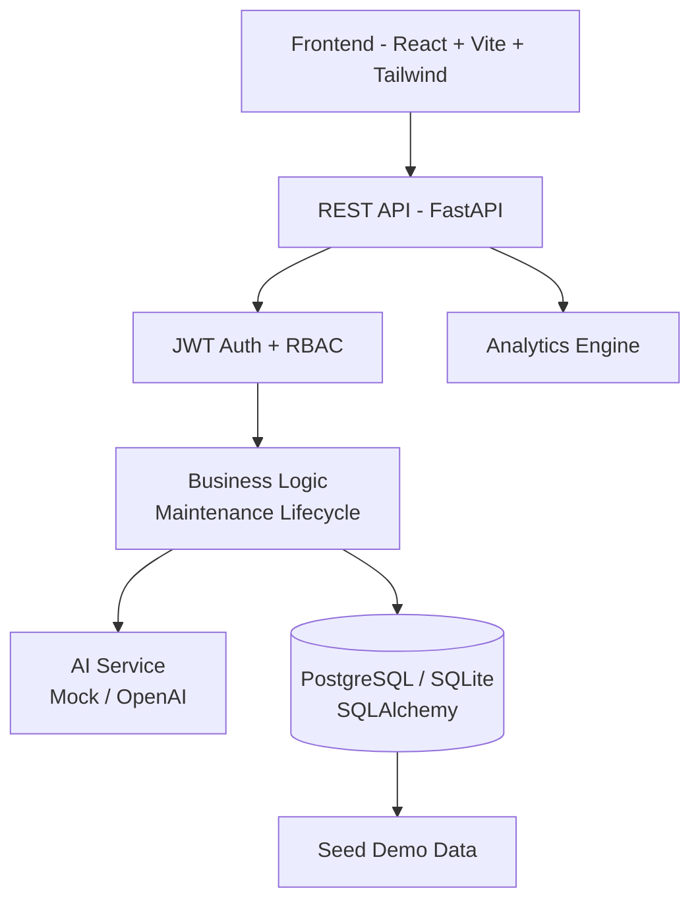
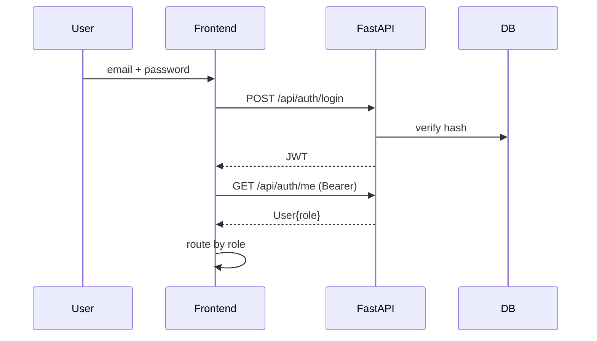
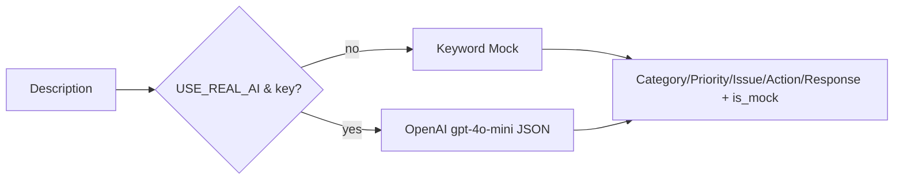

# FixFlow Architecture

## High-level


## Frontend
- **Routes**: `/` landing, `/login`, `/dashboard` (manager), `/tenant`, `/technician`, `/maintenance`, `/properties`, `/analytics`
- **Auth**: `context/AuthContext.tsx` stores JWT in localStorage, Axios interceptor adds `Authorization: Bearer`.
- **Design**: Linear/Vercel-inspired — whitespace, rounded-2xl, zinc palette, Inter, minimal animations.

## Backend
- **FastAPI** `app/main.py` — CORS `*`, creates tables + seeds on boot.
- **Models** `app/models.py`: `User`, `Property`, `Unit`, `MaintenanceRequest`, `MaintenanceNote`, `MaintenanceEvent`, `Notification`
- **Auth** `app/auth.py`: bcrypt hash, `python-jose` JWT (7d expiry), `get_current_user`, `require_roles`.
- **Routers**:
  - `auth` — login/me/demo-accounts
  - `ai` — `/analyze-maintenance`
  - `maintenance` — CRUD + assign/notes/complete + search/filter/sort + notifications
  - `properties` — portfolio + detail (units/tenants/history)
  - `technicians` — list
  - `analytics` — overview (by status/category/property, trends, insights, smart alerts)

## Auth Flow


## Maintenance Lifecycle
```
Reported → Analyzing (AI) → Assigned → Scheduled → In Progress → Completed
```
- Tenant `POST /maintenance` triggers AI, creates `MaintenanceRequest` + `MaintenanceEvent(Reported)` + manager notification.
- Manager `PATCH` or `POST /assign` → event + tech + tenant notifications.
- Technician status updates → events + tenant notifications.
- Completion records `cost` + note + final event.

## AI Analysis Flow

Mock rules: leak/water→Plumbing High, power/outlet→Electrical, hvac→HVAC, appliance→Appliance, crack/roof→Structural, wifi→Internet; flood/burst→Critical, minor/slow→downgrade. UI shows badge `MOCK — deterministic` vs `LIVE AI`.

## Database Relationships
- `User 1—N MaintenanceRequest` (as tenant, as technician)
- `Property 1—N Unit`
- `Unit N—1 User (tenant)`
- `MaintenanceRequest N—1 Property/Unit/User`
- `MaintenanceRequest 1—N MaintenanceNote, MaintenanceEvent`
- `Notification N—1 User`

## Analytics Engine
- Aggregates `MaintenanceRequest` by status/category/property.
- `avg_resolution_hours` from `updated_at - created_at` for Completed.
- Monthly trend buckets last 6 months.
- **Insights**: top category %, highest-cost property, plumbing burst detection (>1.5× avg in 60d).
- **Smart Alerts**: ≥3 plumbing in 45d → preventive inspection; HVAC >30% spending → audit.

## Security
- Password hashing, JWT, RBAC on routes, input validation, CORS, no secrets in repo, file type checks planned.

## Deployment
- Env-driven `DATABASE_URL`, frontend `VITE_API_URL`.
- `Base.metadata.create_all` + seed guard; Alembic ready for migrations.
